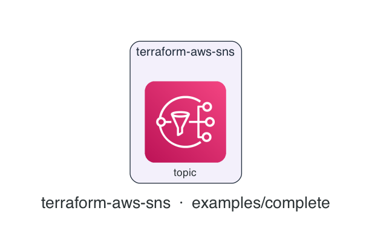

# terraform-aws-sns

[](https://github.com/devotica-labs/terraform-aws-sns/actions/workflows/ci.yml)
[](https://github.com/devotica-labs/terraform-aws-sns/actions/workflows/release.yml)
[](LICENSE)

> Part of the **Devotica** Terraform catalog. Follows the cloudposse module standard (README.yaml-driven docs, the `enabled`/`namespace`/`environment`/`stage`/`name`/`attributes`/`tags`/`label_order` label surface, `examples/complete`, Makefile targets) implemented **natively** — no external naming or build-harness dependencies.

## Introduction

Terraform module for an **Amazon SNS** topic — the pub/sub fan-out primitive that decouples publishers from subscribers. It ships fintech-safe defaults so a topic is encrypted from the moment it exists, with optional subscriptions and an access policy in the same call.

Defaults are opinionated: **encryption on by default** via the AWS-managed `alias/aws/sns` key (swap in a CMK for BYOK), and — when you attach an access policy — a **deny-non-TLS** guard so nothing reaches the topic in the clear. FIFO ordering, subscriptions, and a publish policy are all one input away.

## Architecture

<!-- BEGIN_ARCH -->



<sub>Generated by `.github/workflows/architecture-diagram.yml` on every push to main. Do not edit the image by hand — change the Terraform code in `examples/complete/` and the bot will regenerate it.</sub>

<!-- END_ARCH -->

## Usage

```hcl
module "sns" {
  source  = "devotica-labs/sns/aws"
  version = "~> 0.1"

  namespace = "dvtca"
  stage     = "prod"
  name      = "alerts"        # topic → dvtca-prod-alerts

  subscriptions = {
    ops = { protocol = "https", endpoint = "https://ops.example.com/sns/webhook" }
  }

  # Fintech default covers encryption (alias/aws/sns).
  tags = local.tags
}
```

A FIFO topic with a customer-managed key, fan-out, and a publish policy:

```hcl
module "sns" {
  source  = "devotica-labs/sns/aws"
  version = "~> 0.1"

  namespace = "dvtca"
  stage     = "prod"
  name      = "payment-events"

  fifo_topic        = true                 # topic → dvtca-prod-payment-events.fifo
  kms_master_key_id = module.kms.key_arn   # customer-managed key

  subscriptions = {
    ledger-queue = { protocol = "sqs", endpoint = module.ledger_queue.arn }
  }

  # Grants sns:Publish to these principals and denies all non-TLS access.
  policy_principals = ["arn:aws:iam::111122223333:role/payments-api"]
}
```

See [`examples/basic`](examples/basic) and [`examples/complete`](examples/complete).

## Defaults that matter

| Setting | Default | Why |
|---------|---------|-----|
| `kms_master_key_id` | `alias/aws/sns` | Every topic is server-side encrypted out of the box; supply a CMK id/ARN for BYOK, or `null` to disable. |
| access policy | off unless `policy_principals` set | No policy is attached until you name publish principals — then publish is scoped to them. |
| deny-non-TLS | on with the policy | When a policy is created it also denies any request where `aws:SecureTransport = false`. |
| `fifo_topic` | `false` | Standard topic by default; set `true` for ordered, deduplicated delivery (adds the required `.fifo` suffix). |

## How this fits the Devotica catalog

Pair with `terraform-aws-kms` to back topics with a customer-managed key (pass `key_arn` into `kms_master_key_id`). Downstream workloads subscribe by ARN — an SQS queue, a Lambda, or an HTTPS endpoint — via the `subscriptions` map, and publisher roles (e.g. from `terraform-aws-iam`) go into `policy_principals`.

## Makefile Targets

```
make fmt       # terraform fmt -recursive
make validate  # terraform init -backend=false && terraform validate
make test      # terraform test (unit + contract; integration needs AWS creds)
make readme    # regenerate the terraform-docs block below
```

<!-- BEGIN_TF_DOCS -->
<!-- terraform-docs regenerates this block via `make readme` / CI. Inputs and
     outputs are documented in variables.tf and outputs.tf. -->
<!-- END_TF_DOCS -->

## License

[Apache 2.0](LICENSE) © Devotica
